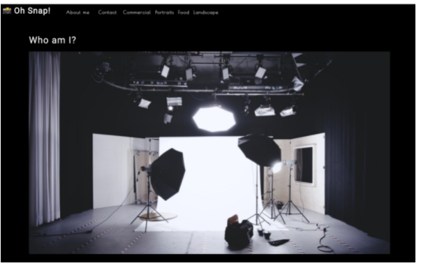

# photo-port
Module 20: React

## Purpose
Assist Lyza, a family friend and budding photographer who needs a no-frills site to display photos. 
Use newfound React skills to create a single-page application called Oh Snap! that uses React state, props, Hooks, and reusable UI components to provide a simple yet sleek platform for showing off those photography skills—and my skill as a developer!

## Built With
* React
* React Testing Library
* jest-dom
* Git Hub

## Contribution
Made with ❤️ by Samantha Malone
Shout out to my tutor
© 2021 Samantha Malone. All rights reserved.
